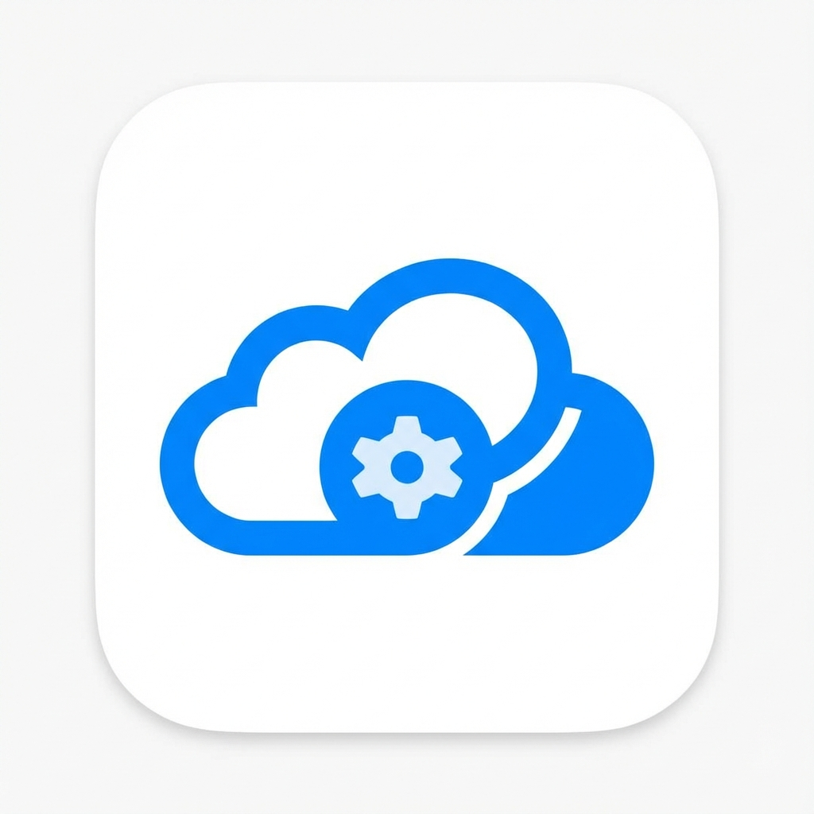

# Xcode Cloud Control

[](https://code.visualstudio.com/)
[](LICENSE)

A Visual Studio Code extension to **manage, monitor, and trigger Xcode Cloud builds** directly from your editor. Similar to the GitHub Actions extension but for Apple's Xcode Cloud CI/CD service.



## ✨ Features

### 📋 Workflow Management
- View all your Xcode Cloud workflows in a dedicated sidebar
- See workflow status (Enabled/Disabled) at a glance
- Trigger builds directly from any workflow

### 🔨 Build Monitoring
- Real-time build status updates with auto-refresh
- View build history for each workflow
- See build progress with animated status icons
- **Desktop notifications** when builds complete or fail

### 📊 Build Actions
- Inspect individual build steps and their status
- View action timing and duration
- Track progress of running builds step-by-step

### 🎛️ Quick Actions
- **Trigger Build** - Start a new build with branch/tag selection
- **Cancel Build** - Stop running builds
- **Open in Browser** - Jump to App Store Connect
- **Status Bar** - At-a-glance view of active builds

## 🚀 Getting Started

### Prerequisites

1. **Apple Developer Account** with Xcode Cloud access
2. **App Store Connect API Key** with the following permissions:
   - Access to Xcode Cloud
   - Read/Write access to CI workflows and builds

### Creating an API Key

1. Go to [App Store Connect → Users and Access → Integrations → App Store Connect API](https://appstoreconnect.apple.com/access/integrations/api)
2. Click the **+** button to create a new key
3. Name your key (e.g., "VS Code Xcode Cloud")
4. Select the appropriate access level (Admin or App Manager recommended)
5. Download the `.p8` private key file (you can only download it once!)
6. Note your **Issuer ID** and **Key ID**

### Configuration

1. Open VS Code Command Palette (`Cmd+Shift+P`)
2. Run **"Xcode Cloud: Configure App Store Connect Credentials"**
3. Enter your:
   - **Issuer ID** - Found in App Store Connect API Keys section
   - **Key ID** - The ID of your API key
   - **Private Key** - Paste the entire contents of your `.p8` file

Your credentials are stored securely using VS Code's Secret Storage.

## 📖 Usage

### Viewing Workflows

1. Click the **Xcode Cloud** icon in the Activity Bar
2. The **Workflows** panel shows all your Xcode Cloud workflows
3. Click a workflow to trigger a build

### Triggering a Build

**From the Workflows panel:**
1. Right-click a workflow
2. Select **"Trigger Build"**
3. Optionally select a branch/tag
4. Build starts and you'll see a notification

**From Command Palette:**
1. Run **"Xcode Cloud: Trigger Build"**
2. Select a workflow
3. Select a branch/tag

### Viewing Build Status

1. The **Build Runs** panel shows recent builds
2. Icons indicate status:
   - 🟢 `✓` - Succeeded
   - 🔴 `✗` - Failed
   - 🔵 `◷` - Pending
   - ⚪ `●` - Running (animated)

### Viewing Build Actions

1. Right-click a build in the **Build Runs** panel
2. Select **"View Build Logs"**
3. The **Build Actions** panel shows individual steps

### Canceling a Build

1. Right-click a running build
2. Select **"Cancel Build"**
3. Confirm the cancellation

## ⚙️ Commands

| Command | Description |
|---------|-------------|
| `Xcode Cloud: Configure App Store Connect Credentials` | Set up your API credentials |
| `Xcode Cloud: Trigger Build` | Start a new build |
| `Xcode Cloud: Cancel Build` | Stop a running build |
| `Xcode Cloud: View Build Logs` | View build actions/steps |
| `Xcode Cloud: Refresh Workflows` | Refresh workflow list |
| `Xcode Cloud: Refresh Build Runs` | Refresh build list |
| `Xcode Cloud: Refresh Build Actions` | Refresh action list |
| `Xcode Cloud: Open in App Store Connect` | Open App Store Connect |

## 🔔 Notifications

The extension automatically notifies you when:
- ✅ A build **succeeds**
- ❌ A build **fails**
- ⚠️ A build is **canceled**

Notifications include a "View Builds" action to jump directly to the build list.

## 🔒 Security

- All credentials are stored using VS Code's **Secret Storage** (encrypted)
- API tokens are generated locally using your private key
- Tokens expire after 18 minutes and are automatically refreshed
- No credentials are ever sent to third parties

## 🛠️ Development

### Setup

```bash
git clone https://github.com/TJMusiitwa/vscode-xcode-cloud-control
cd vscode-xcode-cloud-control
npm install
```

### Building

```bash
npm run compile
```

### Running

Press `F5` in VS Code to launch the Extension Development Host.

### Testing

```bash
npm test
```

## 📝 API Reference

This extension uses the [App Store Connect API](https://developer.apple.com/documentation/appstoreconnectapi) for Xcode Cloud:

- `/v1/ciWorkflows` - List workflows
- `/v1/ciBuildRuns` - List, create, and delete build runs
- `/v1/ciBuildRuns/{id}/actions` - List build actions
- `/v1/scmGitReferences` - List branches and tags

## 🤝 Contributing

Contributions are welcome! Please feel free to submit a Pull Request.

## 📄 License

This project is licensed under the MIT License - see the [LICENSE](LICENSE) file for details.

## 🙏 Acknowledgments

- Inspired by the [GitHub Actions](https://marketplace.visualstudio.com/items?itemName=GitHub.vscode-github-actions) VS Code extension
- Uses the [jose](https://github.com/panva/jose) library for JWT generation
- Uses [undici](https://github.com/nodejs/undici) for HTTP requests